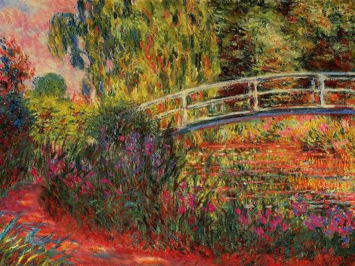
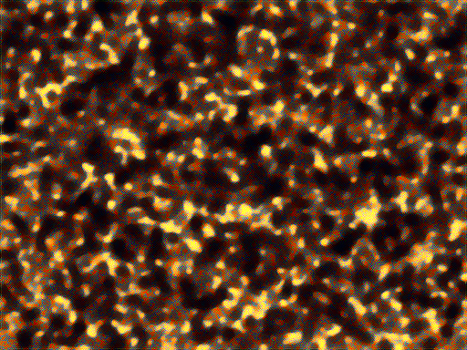

# Exploration of Neural Style Transfer

Here I do a bit more of a deep dive into what the style really means.  There are many layers in VGG, so here I will take the layers individually, and match the style onto a "content image" of noise.  I will also match the single layer onto the content image of my dog.  I will consider two images, "Water Lillies (n>>1)" by Monet and "Tondal's Vision" by (a follower of) Hieronymus Bosch.

'block1_conv1' 
'block1_conv1' 
'block1_conv1' 
'block1_conv1' 
'block1_conv1' 
'block1_conv1' 
'block1_conv1' 
'block1_conv1' 
'block1_conv1' 
'block1_conv1' 
'block1_conv1' 

