# Exploration of Neural Style Transfer

Here I do a bit more of a deep dive into what the style really means.  There are many layers in VGG, so here I will take the layers individually, and match the style onto a "content image" of noise.  I will also match the single layer onto the content image of my dog.  I will consider two images, "Water Lillies (n>>1)" by Monet and "Tondal's Vision" by (a follower of) Hieronymus Bosch.

'block1_conv1' 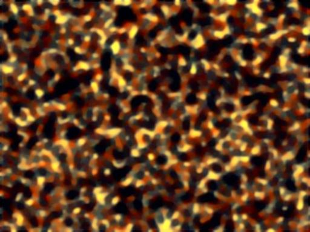  
'block1_conv2' 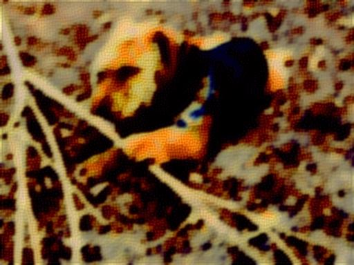  
'block2_conv1' 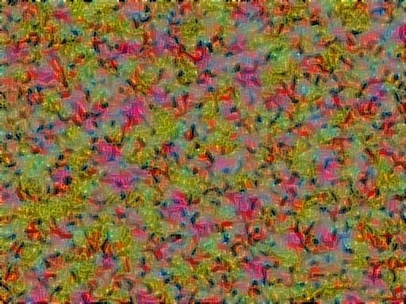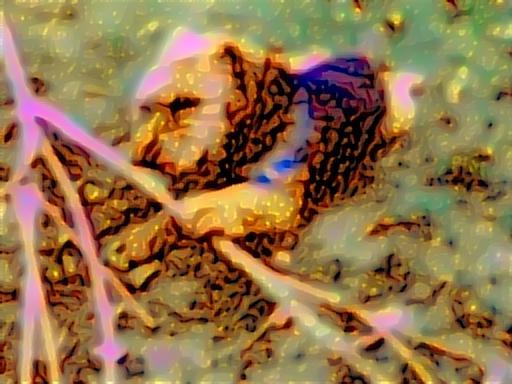  
'block2_conv2' 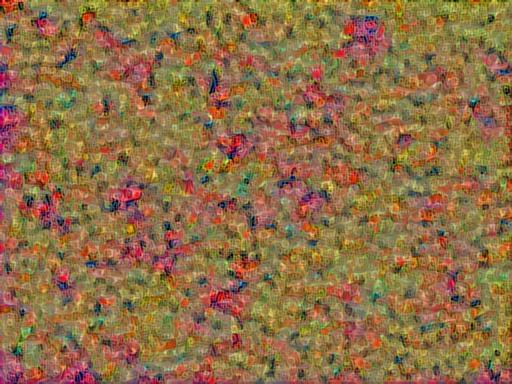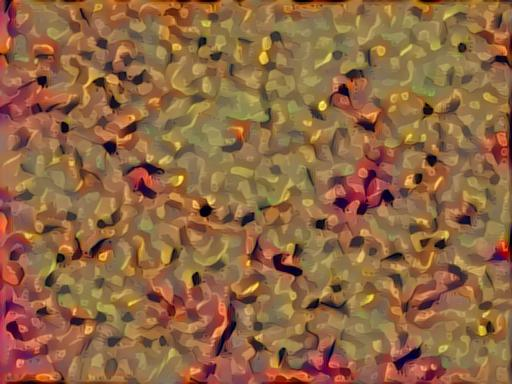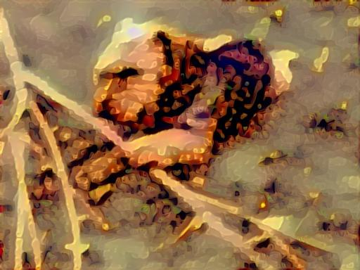  
'block3_conv1' 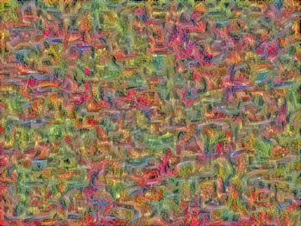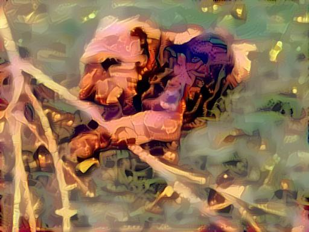  
'block3_conv2' 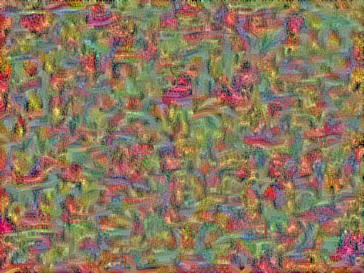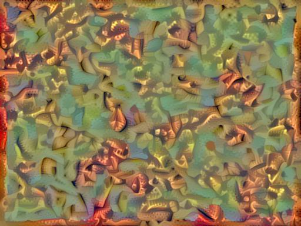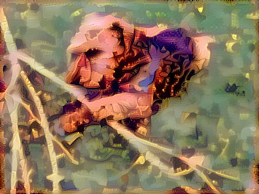  
'block3_conv3' 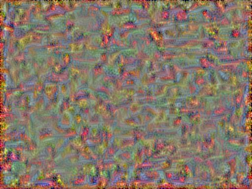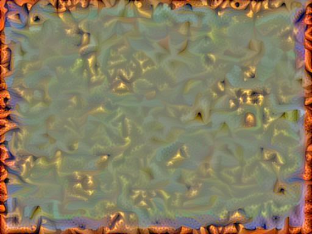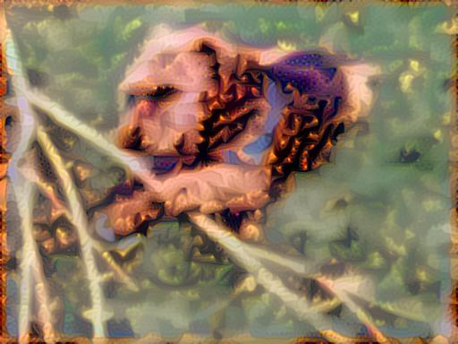  
'block3_conv4' 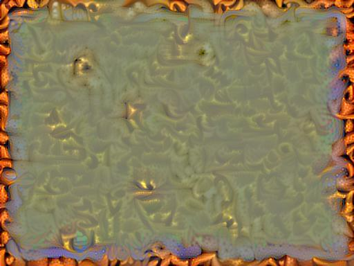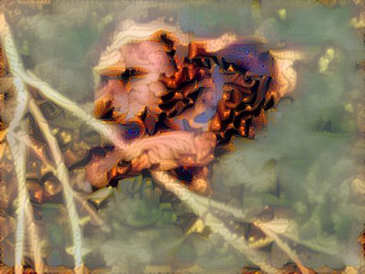  
'block4_conv1' 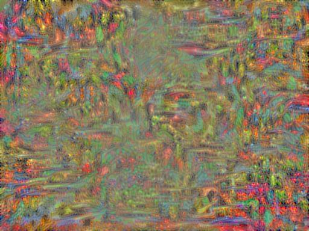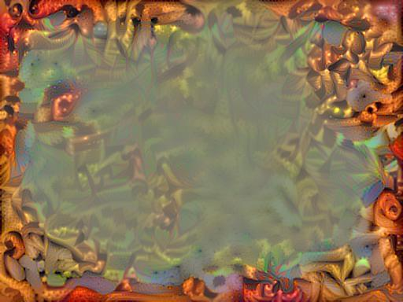  
'block4_conv2' 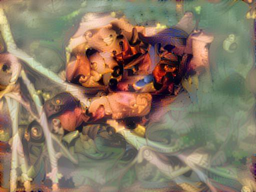  
'block4_conv3' 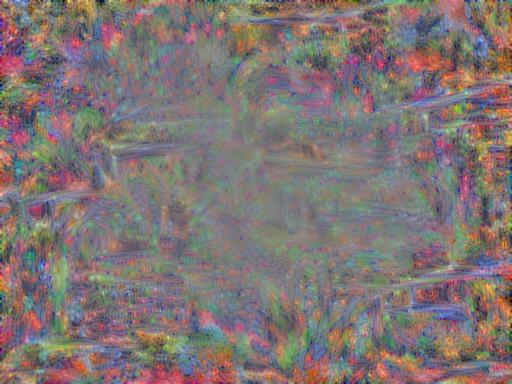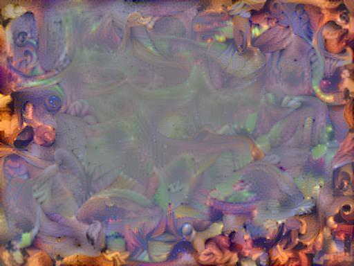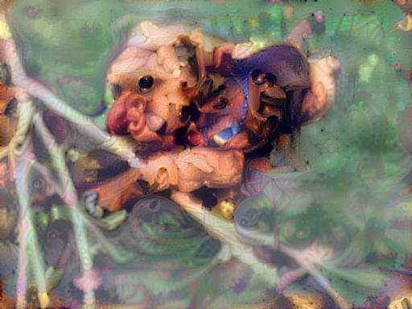  
'block4_conv4' 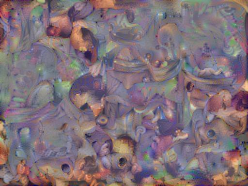  
'block5_conv1' 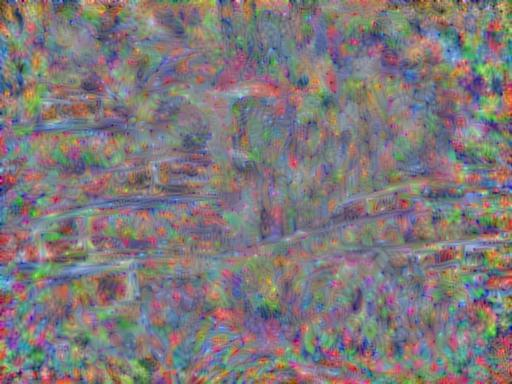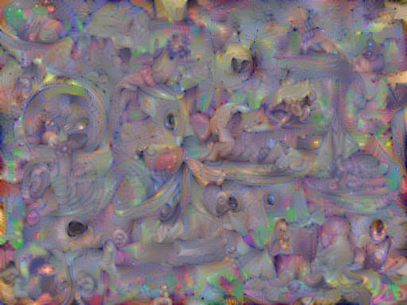  
'block5_conv2' 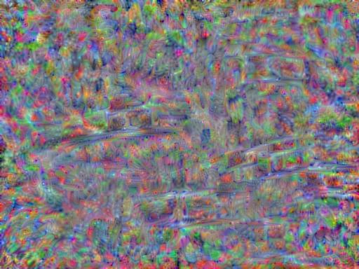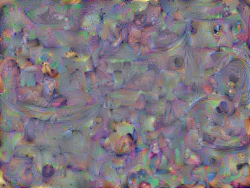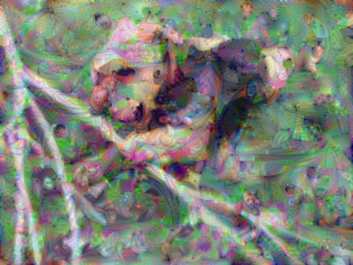  
'block5_conv3' 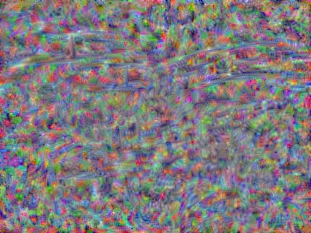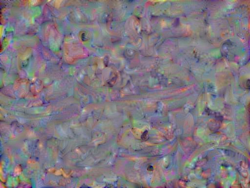  

Several features are pretty clear here:  
1) 'block1_conv1': really seems to only have color information  
2) 'block1_conv2': seems to have color and very local texture information information  
3) 'block2_conv1': catches little lines, which may be important in combining with other layers, but doesn't do much here  
4) 'block2_conv2': catches a bit longer lines, does more than above. but not much overall  
5) 'block3_conv1' & 'block3_conv2': now we can really see structure emerging  
6) 'block3_conv3' & 'block3_conv4' & 'block4_conv1': there is definite structure that gets larger with each layer, but aspects of the parent image not aligned with the features are beginning to fade into the background  
7) 'block4_conv2' & 'block4_conv3': the structure that emerges is no longer local (also this layer does creepy things to my dog's face)  
8) 'block4_conv4' and up: global structures, many weird features: in Monet the bridge emerges, in Tondal there are faces everywhere, there is almost no influence from the style image colors (both Tondal and Monet have the same color scheme, Bacchus is the same color as before)  

