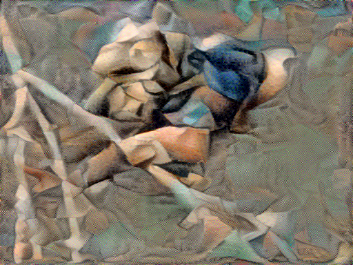
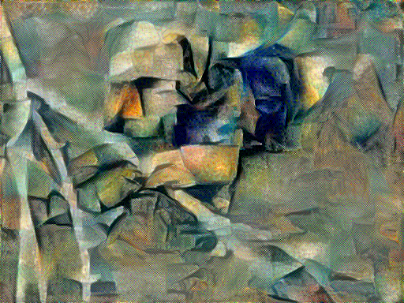
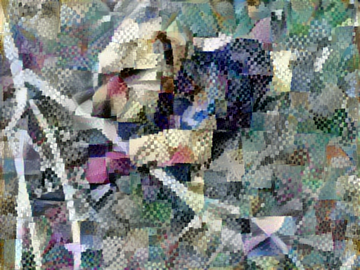
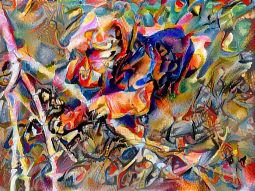
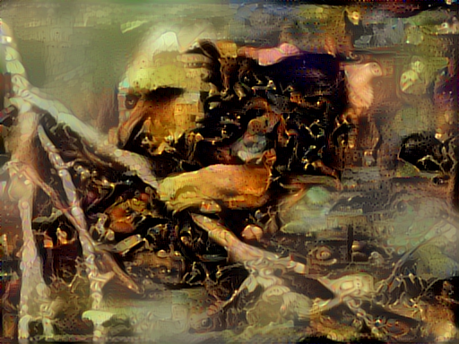
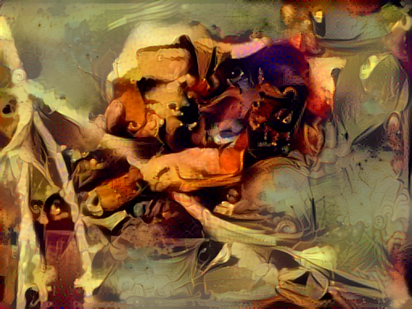
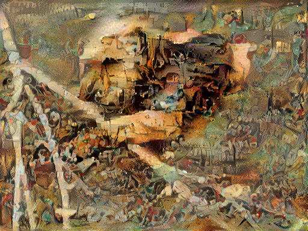
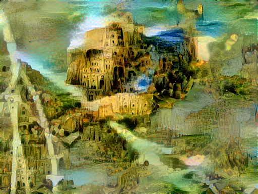

# NeuralStyleTransfer

Interested in understanding style transfer, I set out to create one.  The first version is inline with the tf implementation (from which I adapted my code).  It is pretty awesome.  I definitely want to experiment with it some more, but here are results.  Obviously, I am going to use a photo of my beautiful dog, Bacchus.

