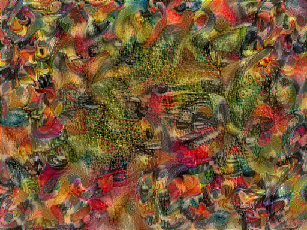
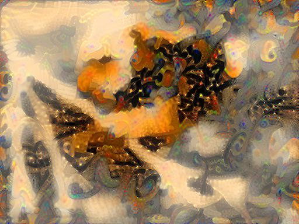

# Neural Style Transfer

## Single style

Interested in understanding neural style transfer, I set out to create one.  This is adapted from the tf implementation.  Obviously, I am going to use a photo of my beautiful dog, Bacchus.

The results are pretty great...

  
  
   
1) Metzinger's *Two Nudes*  
2) Gleizes's *The Bridges of Paris*
3) Delaunay's *Window on the City*  
4) Kandinsky's *Composition VII*
5) Monet's *The Water-Lily Pond*
6) Bruegel's *Tower of Babel*
7) Bruegel's *The Triumph of Death*
8) Bosch Follower's *Christ in Limbo*
9) Bosch Follower's *Tondal's Vision*

## What is Neural Style Transfer?

The basic idea behind neural style transfer is to take an image, and transfer the artistic style of an artist onto it.  This can be done by the following basic process:  
1) Take a CNN (convolutional neural network) trained for multi-purpose image examination (such as VGG19, used here)  
2) Extracting features from some of the layers of the network for both a "content" image and "style" image  
3) Creating a new image, "combo," that minimizes the loss from the content's deviation from "content" and the loss from the style's deviation from "style"  

In a paper by Gatys et al (https://arxiv.org/pdf/1508.06576.pdf), the authors construct this method by using two loss functions:  
1) Content loss:  The "pixel" distance between the "combo" and "content" on a deep layer of the network.   
2) Style loss:  The difference in the Gram matrix of the "combo" and "style" across several layers throughout the network.  In essence the Gram matrix takes a pixel image h x w x n_f, where h and w are the height and width of the image, and converts it into a n_f x n_f matrix that is a measure of how many and by how much each of the layer's features have been represented in that image.  The difference between the gram matrix then tracks how much these features matter.  Importantly, this doesn't care so much *where* the features are located, only that they are there.  This is pulled over multiple layers of the CNN.   

## What is different about my implementation?

1) Adam optimizer: Many implementations use L-BFGS-B to minimize the loss.  This is included in scipy as a wrapper to a FORTRAN function.  Here, I use Adam because it is easier to implement and seems to function just fine.  
2) Variational loss:  This demands adjancent pixels in the combo image do not move too much, i.e. the image is somewhat smooth.  
3) High tunability:  The three different sources of loss are weighted by scalable parameters and raised to variable powers, allowing for an arbiratry customization of transfer.  (Up until now, I have been mostly following in the footsteps of others, but here I start to deviate.)   
4) Common weighting:  I normalize the style losses so that the style image has the same contribution from all included layers.  This means that the features that are present are rewarded, but more significantly, the features that do appear in the combo image that are absent in the style are punished.  The effect of this is sizable, and I found that it tends to create a more interesting combined image.    
5) Removing content loss:  Interestingly, I found starting with the content image, but not having any contribution to the content loss results in the most interesting images (i.e., I typically set the content weight to 0).   
6) Option to start with "combo" = "content" or "combo" = noise: code allows for either option, which was heavily used in the Exploration/ folder.  For the noise, I simply construct an image from random uniformly distributed values for each pixel channel.  

# Dual style transfer

Instead of transfering one style, we could try to transfer two styles: a fine style, which captures colors and textures from the early layers, and a coarse style, which captures more global stylistic features from the image.  This is implemented in the file DualNST.ipynb.  Below, we have a grid of images.  The top left is the content source (Bacchus), while the rest of the top row are the coarse style source images (Composition VII, Tondal's Vision, The Bridges of Paris).  The left column has the fine style source (Tower of Babel, The Water-Lily Pond, The Triumph of Death).  The remaining images are the fine + coarse styles applied as indicated by the image position. 

  
  
  
  

Note how the colors are textures are mostly preserved from the images on the left (fine style), while larger features (music symbols, creepy faces, sharp angles) are largely preserved from the top row.  All look very "Bacchus," even though the content (his image) is only the initial condition.  We could also use noise as the initial condition and apply fine and coarse features:  

# Triple Neural Style Transfer

As can be observed from the Exploration folder, there is a lot of difference between the 1st, 3rd, and 5th block of the network.  We could instead 
try to transfer three styles to the image - roughly as colors, small features, and large features (A, B, C respectively). This is in TriNST.ipynb. These style transfers are definitely rather tempermental - if the adjacent style is too discordant, there tend to be a lot of artifacts produced.  Turning up the smoothing (v_w) can help a lot, but it isn't always enough.    

>

We can choose multiple ways to apply this, as an example we will show Tower of Babel as content, Bridges of Paris / Babel as style - in order 1) ABC - Babel (no Paris applied, only smoothing); 2) AB - Babel, C - Paris; 3) AC - Babel, B - Paris; 4) BC - Babel, A - Paris; 5) A - Babel, BC - Paris; 6) B - Babel, AC - Paris; 7) C - Babel, AB - Paris; 8) ABC - Paris  

   

Notice how A is really governing the color scheme (1235 vs 4678); B is capturing small details, e.g., tower windows, foreground (1246 vs 3578); and C is getting the largest features, e.g., shape of the tower, surrounding hills (1347 vs 2568).

# Summary

Neural style transfer can be customized quite a bit.  The transfer of styles from different regions can result in very different images.  My interest in this was just to produce some fascinating visual art, and to better understand the layers in a convnet.
